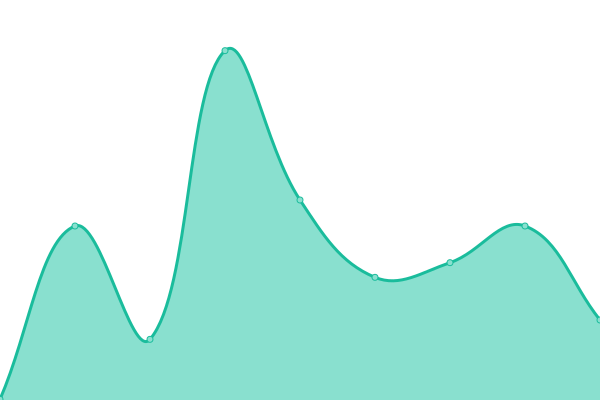
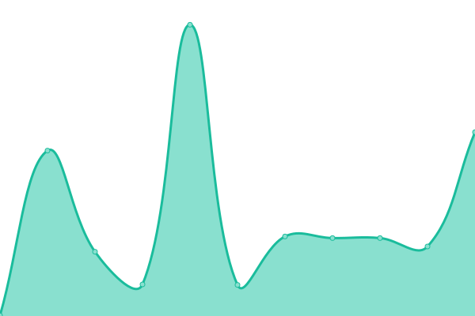

# [📈 Live Status](https://nishidhjain.github.io/upptime-repo): <!--live status--> **🟩 All systems operational**

This repository contains the open-source uptime monitor and status page for [Nishidh Jain](https://nishidhjain.github.io/upptime-repo), powered by [Upptime](https://github.com/upptime/upptime).

With [Upptime](https://upptime.js.org), you can get your own unlimited and free uptime monitor and status page, powered entirely by a GitHub repository. We use [Issues](https://github.com/nishidhjain/upptime-repo/issues) as incident reports, [Actions](https://github.com/nishidhjain/upptime-repo/actions) as uptime monitors, and [Pages](https://nishidhjain.github.io/upptime-repo) for the status page.

<!--start: status pages-->
<!-- This summary is generated by Upptime (https://github.com/upptime/upptime) -->
<!-- Do not edit this manually, your changes will be overwritten -->
<!-- prettier-ignore -->
| URL | Status | History | Response Time | Uptime |
| --- | ------ | ------- | ------------- | ------ |
|  [JobDundho](https://jobdundho.com/) | 🟩 Up | [job-dundho.yml](https://github.com/NishidhJain/upptime-repo/commits/HEAD/history/job-dundho.yml) | 

 594ms
     
 | 

<a href="https://nishidhjain.github.io/upptime-repo/history/job-dundho">97.95%</a>
    

|  [Github User Dashboard](https://github-users-dashboard.netlify.app/) | 🟩 Up | [github-user-dashboard.yml](https://github.com/NishidhJain/upptime-repo/commits/HEAD/history/github-user-dashboard.yml) | 

 123ms
     
 | 

<a href="https://nishidhjain.github.io/upptime-repo/history/github-user-dashboard">100.00%</a>
    

|  [Movieocity](https://movieocity.netlify.app) | 🟩 Up | [movieocity.yml](https://github.com/NishidhJain/upptime-repo/commits/HEAD/history/movieocity.yml) | 

 118ms
     
 | 

<a href="https://nishidhjain.github.io/upptime-repo/history/movieocity">100.00%</a>
    

<!--end: status pages-->

[**Visit our status website →**](https://nishidhjain.github.io/upptime-repo)

## 📄 License

- Powered by: [Upptime](https://github.com/upptime/upptime)
- Code: [MIT](./LICENSE) © [Nishidh Jain](https://nishidhjain.github.io/upptime-repo)
- Data in the `./history` directory: [Open Database License](https://opendatacommons.org/licenses/odbl/1-0/)
